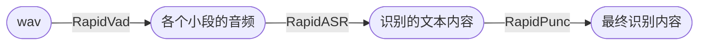

## Rapid ASR

    
    
    
    <a href="">=3.6,<3.12-aff.svg"></a>
    

- 🎉 推出知识星球[RapidAI私享群](https://t.zsxq.com/0duLBZczw)，这里的提问会优先得到回答和支持，也会享受到RapidAI组织后续持续优质的服务。欢迎大家的加入。
- Paraformer模型出自阿里达摩院[Paraformer语音识别-中文-通用-16k-离线-large-pytorch](https://www.modelscope.cn/models/damo/speech_paraformer-large_asr_nat-zh-cn-16k-common-vocab8404-pytorch/summary)。
- 本仓库仅对模型做了转换，只采用ONNXRuntime推理引擎。该项目核心代码已经并入[FunASR](https://github.com/alibaba-damo-academy/FunASR)。
- 项目仍会持续更新，欢迎关注。
- QQ群号：645751008

#### 📖文档导航
- 语音识别：
    - rapid_paraformer:
        - [rapid_paraformer-Python](./python/README.md)
        - [rapid_C++/C](./cpp_onnx/readme.md)
    - [rapid_wenet](https://github.com/RapidAI/RapidASR/tree/rapid_wenet)
        - [Python](https://github.com/RapidAI/RapidASR/tree/rapid_wenet/python)
        - [C++](https://github.com/RapidAI/RapidASR/tree/rapid_wenet/cpp)
    - [rapid_paddlespeech-Python](https://github.com/RapidAI/RapidASR/tree/rapid_paddlespeech)
- 标点符号
    - [RapidPunc](https://github.com/RapidAI/RapidPunc)

#### 📆TODO以及任务认领
- 参见这里：[link](https://github.com/RapidAI/RapidASR/issues/15)

#### 🎨整体框架

#### 📣更新日志

详情

- 2023-08-21 v2.0.4 update:
  - 添加whl包支持
  - 更新文档
- 2023-02-25
   - 添加C++版本推理，使用onnxruntime引擎，预/后处理代码来自： [FastASR](https://github.com/chenkui164/FastASR)
- 2023-02-14 v2.0.3 update:
  - 修复librosa读取wav文件错误
  - 修复fbank与torch下fbank提取结果不一致bug
- 2023-02-11 v2.0.2 update:
  - 模型和推理代码解耦（`rapid_paraformer`和`resources`）
  - 支持批量推理（通过`resources/config.yaml`中`batch_size`指定）
  - 增加多种输入方式（`Union[str, np.ndarray, List[str]]`）
- 2023-02-10 v2.0.1 update:
  - 添加对输入音频为噪音或者静音的文件推理结果捕捉。

