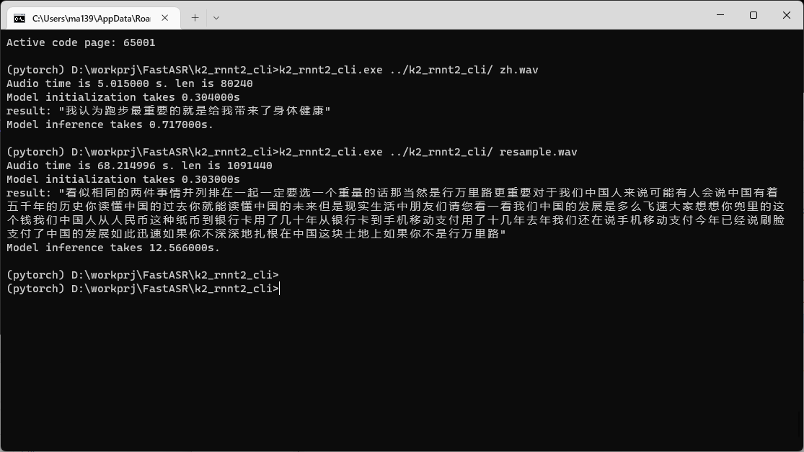

# 最简编译指南

取下代码后用Vs2022 打开cmakelists.txt 编译即可。

注意：在安装vs2022时，需要安装linux 开发组件以支持cmakelists.txt工程。

## Demo
CPU:  i7-7820HQ @ Windows 11

    

## 准备windows依赖库 （专业用户参考，普通用户无需考虑）

### build fftw3 (from a prebuild version to generate libs)

https://blog.csdn.net/NICAI001/article/details/116887842

### openblas

https://github.com/xianyi/OpenBLAS/releases
